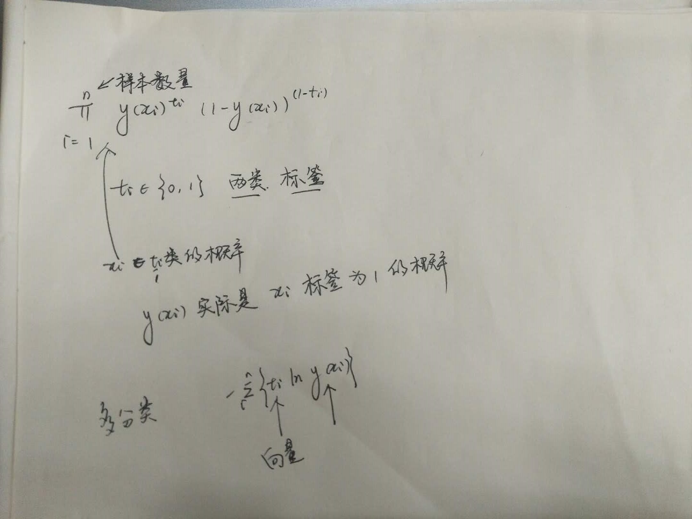
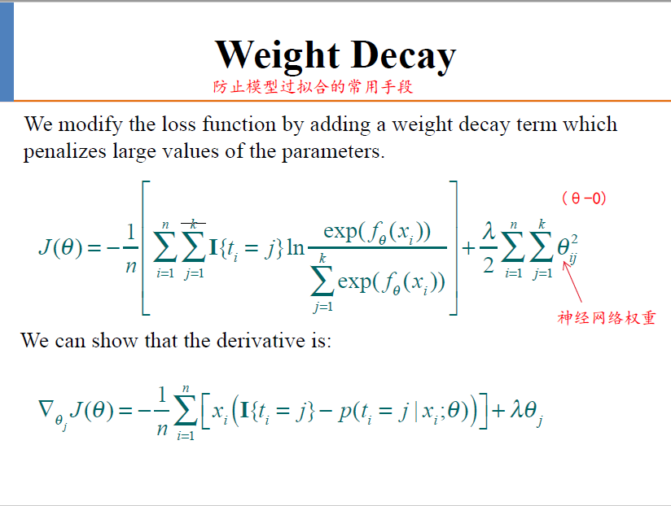
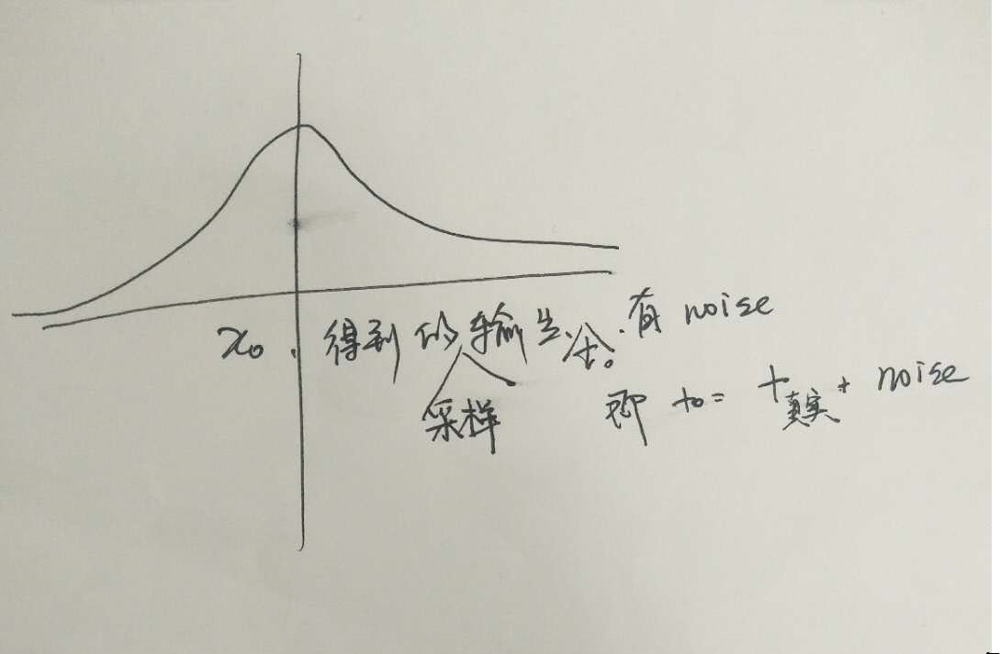

### 自然语言处理

1. 向量表示可以调整

   大量无监督训练->调整向量表示

   词向量(两个语法接近、语义等价的词在图谱中距离较为接近)

   运算

2. 调整最原始的输入表示，通过预训练调整，由标记样本训练出的模型同样可以正确处理相近的语句(鲁棒性)

   - 与离散中的处理的不同点

### 机器学习

1. 拟合 和 分类

   - 拟合[BP网络]：模型输出结果与实际结果尽量相近

     - Squared errors：定义在整个样本集上，t 目标结果，y 模型函数
       $$
       Error = \frac{1}{2}\pi (t_i-y(x_i))^2
       $$
       

   - 分类：

     - Cross entropy交叉熵：y概率，t 标签{0,1} | {100,010,001}，衡量两个概率 \

     - 分布的距离
       $$
       Error =- \pi t_iln\ y(x_i)
       $$
       

   

2. Logistic Classification
   $$
   y(x_i)=\frac{1}{1+e^{-f_\theta(x_i)}}
   $$

3. logit(log odds)：两个类别间概率比值取对数

4. 神经网络​ :egg:

5. 

6. 神经网络在不同参数启动的情况下，模型不同；线性模型与之不同，<u>解析法</u>，确定的模型

7. 贝叶斯学派：把先验经验/信息放入统计框架中，将专家的知识放入框架得到先验值，之后根据样本信息，得到后验结果

   频率学派：先假设一个概率分布，进行验证，如果落入拒绝域，那么说明假设的概率分布是不正确的，否则可以认为假设的概率分布可以接受

   频率学派要求实验可以重复，当只能进行少次实验时，贝叶斯学派允许加入先验经验

8. 

9. 正态分布、协方差？
10. 协方差矩阵
11. 

    
