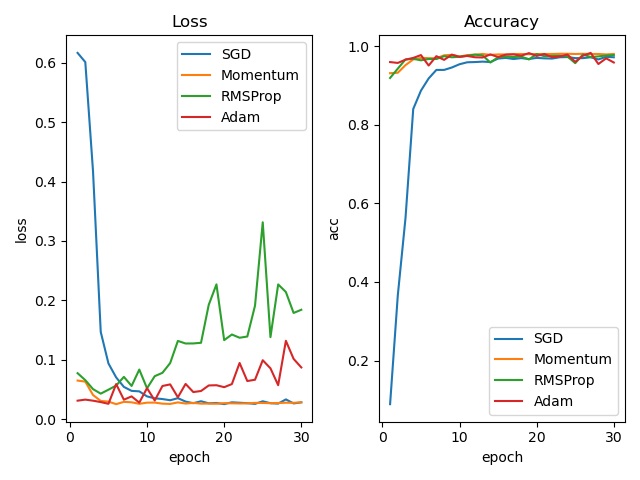
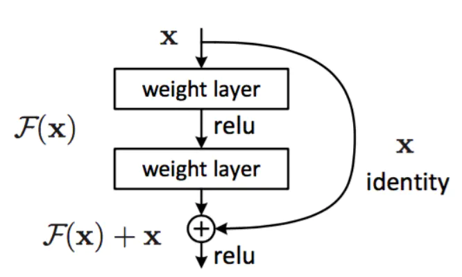
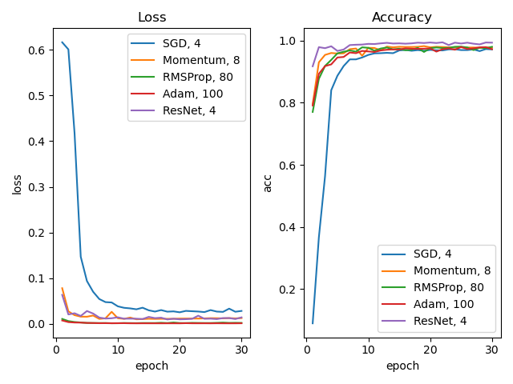

## 智能系统原理与开发 lab 1

### 1. 代码基本架构

#### 1.1 代码结构

```sh
.
├── DATASET					# 数据集
│   ├── test					# 测试集
│   └── train					# 训练集
├── README.md				# 文档
├── algorithm				# 源代码
│   ├── CNN.py					# 一般 CNN
│   ├── ResNet.py				# ResNet
│   ├── Util.py					# 训练用到的辅助函数
├── assets					# 训练过程截图
├── main					# 比较不同的网络
│   ├── Compare.py				# 比较网络的源代码
│   └── test_CNN				# 比较不同优化器下的准确率
│       └── CNN_optm.py
└── record					# 记录训练结果
```


#### 1.2 CNN.py

```python
'''
一般的CNN网络
'''
class CNN(nn.Module):
    def __init__(self):
        super(CNN, self).__init__()
        self.conv1 = nn.Conv2d(3, 6, 5)			# 卷积层
        self.pool = nn.MaxPool2d(2, 2)			# 池化层
        self.conv2 = nn.Conv2d(6, 16, 5)		# 卷积层
        self.fc1 = nn.Linear(16 * 4 * 4, 120)	# 全连接层
        self.fc2 = nn.Linear(120, 84)
        self.fc3 = nn.Linear(84, 12)

    def forward(self, x):
        x = self.pool(F.relu(self.conv1(x)))		# 卷积层->relu->池化层
        x = self.pool(F.relu(self.conv2(x)))		# ...
        assert self.fc1.in_features == self.num_flat_features(x)
        x = x.view(-1, self.num_flat_features(x))
        x = F.relu(self.fc1(x))						# 线性层->relu
        x = F.relu(self.fc2(x))						# ...
        x = self.fc3(x)								# 线性层
        return x

    def num_flat_features(self, x):
        size = x.size()[1:]
        num_features = 1
        for s in size:
            num_features *= s
        return num_features
```


#### 1.3 ResNet

```python
class ResNetModel(nn.Module):		# ResNet 网络

class ResidualBlock(nn.Module):		# building block (ResNet 18/34)

class BottleNeckBlock(nn.Module):	# bottleneck design	(ResNet 50/101/152)
```


#### 1.4 训练过程

```python
'''
dataset: 数据集，可以是训练集、验证集测试集
dataloader: 数据加载器
net: 网络结构
criterion: 损失函数
train: 是否为训练过程
optimizer: 优化器，非训练过程下，不需要提供优化器
'''
def calculate(dataset, dataloader, net, criterion, train=False, optimizer=None):
    running_loss = 0.0
    running_acc = 0.0
    for i, data in enumerate(dataloader, 0):
        inputs, labels = data

        if train:		# 训练的情况下
            optimizer.zero_grad()
            outputs = net(inputs)
            loss = criterion(outputs, labels)
            loss.backward()
            optimizer.step()
        else:			# 非训练情况下
            outputs = net(inputs)
            loss = criterion(outputs, labels)

        running_loss += loss.item()
        _, predict = torch.max(outputs, 1)
        correct_num = torch.sum(torch.eq(labels, predict))	# 因为是批处理过程
        running_acc += correct_num.item()

    running_loss /= len(dataset)
    running_acc /= len(dataset)

    return running_loss, running_acc	# 返回 loss 和 准确率
```


### 2. 实验对比

#### 2.1 设置不同的优化器

1. 网络结构设置：统一采用 1.2 中所示的网络结构

2. 损失函数：交叉熵 `CrossEntropyLoss()` [ pytorch 中该函数结合了两部分，softmax 和 loss，因而网络结构中无须增加 softmax 层]

3. 批处理大小：4

4. 训练次数 30 次

5. 图片处理过程：

   ```python
   transforms.Compose([transforms.ToTensor(),
                                   transforms.Normalize([0.485, 0.456, 0.406],
                                                        [0.229, 0.224, 0.225])])
   ```

6. 优化器设置，学习率统一设置 LR=0.001

   - SGD: `torch.optim.SGD(net_SGD.parameters(), lr=LR)`
   - Momentum: `torch.optim.SGD(net_Momentum.parameters(), lr=LR, momentum=0.9)`
   - RMSProp: `torch.optim.RMSprop(net_RMSProp.parameters(), lr=LR, alpha=0.9)`
   - Adam: `torch.optim.Adam(net_Adam.parameters(), lr=LR, betas=(0.9, 0.999), eps=1e-8)`

7. 实验结果如下图所示：

   

   

   从右图可以看出，在上述参数设置下，经过 15 次训练后，四种优化器下的训练准确度都已经到达峰值，之后的训练中，准确度变化不大；

   然而左图中，RMSProp 和 Adam 随着训练次数增多，loss 都呈上升趋势，并且十分不稳定，通过查找资料发现这两种优化器在 batch 较大的情况下更加稳定，因此需要增大 batch size 再比较，不同batch_size下的实验比较请移步 2.3；

   比较 SGD 和 Momentum 可以看出，加了动量因子之后，不仅能够加速收敛，而且可以抑制震荡，表现就是更早到达准确率的峰值，loss 曲线更平滑

   

#### 2.2 ResNet

深度残差网络 (ResNet) 是由何凯明团队提出的，主要是为了解决网络的退化现象：当网络深度增加时，网络性能并没有提高，甚至准确率更低了，通过在训练集本身上测试，可以排除过拟合原因

其思想也很简单，当网络性能达到峰值时，此时再训练只会导致误差增大或者不变，那么为什么不增加几个全等映射层来保证误差至少不会增加呢？

于是产生了如下的学习单元：



弧线就是全等映射层，x->x，F(x) 就是残差[差取自 F(x)=y-x]

ResNet 相当于改变了学习目标，从一个完整的输出，变成了输出与输入的差 F(x) ，也就是残差

实验如下：

1. 网络结构设置：ResNet 18

2. 损失函数：交叉熵 `CrossEntropyLoss()` [ pytorch 中该函数结合了两部分，softmax 和 loss，因而网络结构中无须增加 softmax 层]

3. 批处理大小：4

4. 训练次数 30 次

5. 图片处理过程：

   ```python
   [transforms.RandomResizedCrop(224),
                                       transforms.ToTensor(), transforms.RandomHorizontalFlip(),
                                       transforms.Normalize([0.485, 0.456, 0.406],
                                                            [0.229, 0.224, 0.225])]
   ```

6. 优化器选用 Adam，参数选用论文中建议的设置

7. 实验结果请移步 2.3


#### 2.3 比较最优结果



1. 通过实验，最终对四种优化器分别选取 batch_size 为 4、8、80、100，可以发现，设置更大的 batch_size，RMSProp 和 Adam 的误差变化更平滑

2. 通过右图可以很明显地看出，ResNet 的收敛速度快，准确率也更高

3. 增加动量后，Momentum 相比 SGD 有了明显的性能提升，这是因为动量因子模拟了物理中动量的概念，利用累积动量来代替真正的梯度，其特点为：

   - 在下降初期，使用上一次的参数更新，因此下降方向一致，收敛速度更快
   - 在下降中后期，在局部最小值来回震荡的时候，更新幅度增大，跳出陷阱
   - 在梯度改变方向的时候，能够减小更新，变化更加平滑

4. ResNet vs. CNN：

   从网络结构上来看，ResNet 比 CNN 多了就是那些弧线，将输入直接连到后面的层，这些弧线叫做 shortcut

   传统的卷积层或全连接层在向前传播时，或多或少都有发生信息丢失或者信息损耗，这些弧线某种程度上解决了这个问题，将输入直接传到输出，保护了信息的完整性，整个网络只需要学习输入和输出的差别部分，简化了学习的目的和学习的难度


### 3. 对网络设计的理解

1. 卷积神经网络相较于前面实现的 BP 神经网络，核心区别就是前者利用卷积核只保留关键特征，既减少参数量，也降低了噪音对训练过程的干扰
2. ResNet 相较于一般 CNN，其实只是增加了全等映射层，但是性能上却有了显著的提升
3. 比较 ResNet 的两种单元设计，两层和三层设计，大多都更加推荐后者，虽然网络层数更多，但是参数更少
4. 因而，对网络结构的设计可以有一下理解：
   - 神经网络的结构并不局限于单一的线型的结构，也可以考虑增加多余的边提高网络性能
   - 在网络结构的设计中，并不是网络层数越少就越优的，还要考虑网络传播中的损失，参数的多少等问题
5. 在参数选择中，可以有如下经验：
   - 影响 CNN 网络的关键超参数包括学习率、迭代次数、批次大小、激活函数等，再寻找最优参数时，可以从粗到细分阶段调参，首先选取相关论文中推荐的参数作为初始参数，之后根据实验结果调节，如果模型无法收敛，首先需要考虑学习率设置是否不合适
   - 调参是为了寻找合适的参数，并不是为了得到最终的模型，因此可以首先在小数据集上训练，可以选取训练数据的 1/10 进行试验，也可以比如选取 2 个类别进行试验，一般在小数据集上合适的参数，在大数据集上也不会太差
   - 当然也有一些自动调参的方法供选择