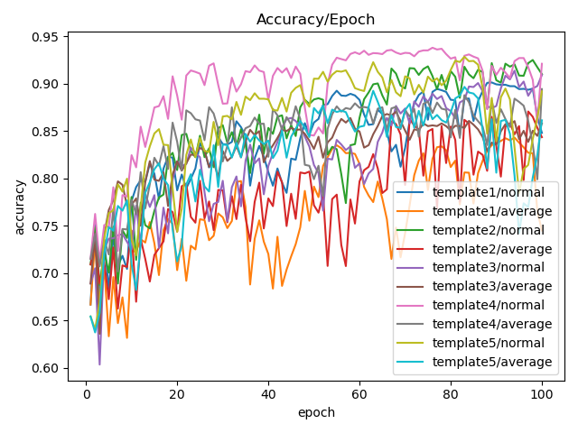
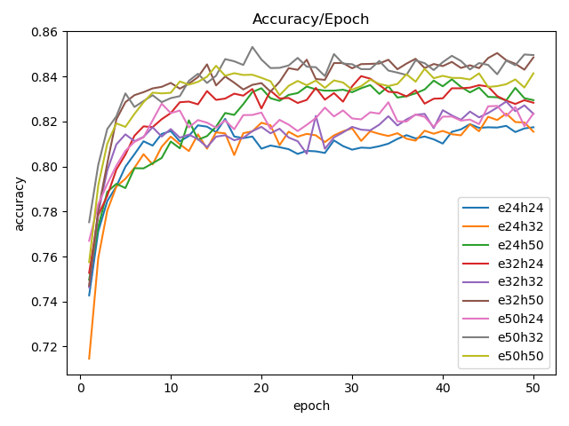

# 智能系统 lab 2 文档

## 1. HMM

1. HMM 有两种学习方式，有监督学习和无监督学习；后者是通过 EM 算法调整参数学习到知识，前者则是基于统计学习到知识

2. 通过两种方式的实验对比，我发现无监督学习存在以下问题：

   - 实现复杂
   - 学习成本高，每轮迭代时间长
   - 准确率低

   EM 算法主要包括两个过程，E 过程和 M 过程，这两个过程就类似 BP 神经网络中向前传播和向后传播，E 过程得到期望，M 过程使期望最大，调整参数，不断迭代，直至准确率变化很小或准确率达到期望要求

   无论是 E 过程还是 M 过程都涉及大量的计算，~~并且对于相同的数据情况下，无监督学习能够学习到的知识上限就是有监督学习统计得到的知识，因此学习成本高且准确率低~~，倘若 M 过程的优化目标不是凸的，那么 EM 算法并不能保证收敛到全局的极大值点

3. 然而有监督学习也有其局限性，最大的局限就是因为是基于数据的统计，那么其准确率和数据的数量和质量紧密相关，并且扩展性差

4. HMM 有两个基本的假设：

   - 齐次马尔科夫性假设，即任意时刻 t 的状态仅与前一时刻状态相关，与其他时刻的状态、时刻 t 都无关
   - 观测独立性假设，任意时刻 t 的观测仅依赖于该时刻 HMM 的状态，与其他观测及状态无关

   受限于上面两个假设，HMM 并不能学习到更多的特征，泛化能力有限

5. HMM 中用到的统计语言模型是二元模型(Bigram Model)，当然也可以扩展到 N 元模型，也就是任意时刻 t 的状态与前面 N 个时刻的状态相关，与其他时刻的状态无关，但是这样的扩展代价是很高的，最容易发现的就是扩展之后，导致转移矩阵的规模指数式增大，并且细化到具体问题中，可能时刻 t 的状态并不是与前面所有 N 个状态相关，可能仅仅与其中几个状态相关

   > 由此，可以理解 CRF 的基本思想 :arrow_down:

## 2. CRF

1. 基于上面对 HMM 的分析，可以将 CRF 简单理解为：时刻 t 的状态不止与前面一个时刻的状态相关，也会与前面 N 个时刻的状态和观测值相关，但是并不是前面 N 个时刻的状态和观测值都会对时刻 t 有影响，并且影响的大小可能会有差异，由此得到模板

2. 在实验中比较了以下五个模板的准确度，取训练数据集的 90% 训练，其余数据做测试

   |      | 模板                                                         |
   | :--: | ------------------------------------------------------------ |
   |  ①   | **#Unigram** U01:%x[-1,0] **\|\|** U02:%x[0,0] **\|\|** U03:%x[1,0] **\|\|** U04:%x[-2,0]/%x[-1,0] **\|\|** U05:%x[0,0]/%x[1,0] **\|\|** U06:%x[1,0]/%x[2,0] **#Bigram** |
   |  ②   | **#Unigram** U01:%x[-1,0] **\|\|** U02:%x[0,0] **\|\|** U03:%x[1,0] **\|\|** U04:%x[-2,0]/%x[-1,0] **\|\|** U05:%x[0,0]/%x[1,0] **\|\|** U06:%x[1,0]/%x[2,0]  **#Bigram** B02:%x[0,0] |
   |  ③   | **#Unigram** U00:%x[-2,0] **\|\|** U01:%x[-1,0] **\|\|** U02:%x[0,0] **\|\|** U03:%x[1,0] **\|\|** U04:%x[2,0] **\|\|** U05:%x[-2,0]/%x[-1,0] **\|\|** U06:%x[0,0]/%x[1,0] **\|\|** U07:%x[1,0]/%x[2,0] **#Bigram** B01:%x[-1,0] **\|\|** B02:%x[0,0] **\|\|** B03:%x[1,0] |
   |  ④   | **#Unigram** U01:%x[-1,0] **\|\|** U02:%x[0,0] **\|\|** U03:%x[1,0] **\|\|** U04:%x[-2,0]/%x[-1,0] **\|\|** U05:%x[-1,0]/%x[0,0] **\|\|** U06:%x[-1,0]/%x[1,0] **\|\|** U07:%x[0,0]/%x[1,0] **\|\|** U08:%x[1,0]/%x[2,0] **#Bigram** B02:%x[0,0] |
   |  ⑤   | **#Unigram** U01:%x[0,0] **#Bigram** B01:%x[-1,0] **\|\|** B02:%x[0,0] **\|\|** B03:%x[1,0] **\|\|** B04:%x[-2,0]/%x[-1,0] **\|\|** B05:%x[0,0]/%x[1,0] **\|\|** B06:%x[1,0]/%x[2,0] |

3. 实验结果如下图所示：**normal** 表示训练中得到的模板参数不处理，**average** 则对参数取平均值

4. 从实验数据中可以看出，④ 号模板并且不对模板参数处理的情况下，精确率最高，也就是建模能力最好，其次就是 ⑤ 号模板；`average` 的效果普遍不如 `normal`

   - 因此可以得出 01:%x[-1,0] **||** 02:%x[0,0] **||** 03:%x[1,0] **||** 04:%x[-2,0]/%x[-1,0] **||** 05:%x[0,0]/%x[1,0] **||** 06:%x[1,0]/%x[2,0] 基本可以表征数据的绝大部分特征

   - 在上面一点中并没有指明是一元模板还是二元模板，原因在于二者的区别就是是否考虑前一个时刻的状态，在中文分词中就是是否考虑前一个字的状态(BIES)

     基于直觉，对于同一词而言，状态序列大多数情况下都是一样的，像是 `中国人民生活` 这样，对于任意两个相邻的字都能成词的情况并不多，放进模板中也就是指当前字的状态基本只与当前观测到的字和相邻的字相关，与前一个字是什么状态的关系相对小

     因此即便 ④ 号模板没有考虑很多的二元模板，精确率也能达到一个很高的值

   - 当然，模板越多，能够表征的特征就越多，但是也会很容易因为过于精确而使泛化能力削弱

## 3. BiLSTM + CRF

1. BiLSTM + CRF 就是将双向的 LSTM 和 CRF 组合起来，在 LSTM 中基于一定的规则忘记、选择记忆历史信息，再结合 CRF 中的开始矩阵、转移矩阵等的条件限制得到最有可能的输出结果；简单地，可以理解为在神经网络上增加了限制条件

2. 同样对参数做了实验，实验中只有一层 LSTM

   |     参数      | 取值范围   | 描述                                                         |
   | :-----------: | ---------- | ------------------------------------------------------------ |
   | EMBEDDING_DIM | [24,32,50] | 嵌入层相关的参数，简单理解，该层就是将单词表中字进行编码，这个参数指定的就是编码的长度，同时是输入特征维数 |
   |  HIDDEN_DIM   | [24,32,50] | 隐藏层状态的维数，也就是隐藏层的节点个数                     |

3. 取训练数据的 10% 用来实验，其中 90% 训练模型，其余数据做验证集，实验结果如下：

   

   图例中 e 表示 input_size，h 表示 hidden_size

4. 从实验结果可以看出，`e50h32` 和 `e32h50` 的结果较好

## 4. 模型比较

1. 基于实验中得到的数据，可以得出以下结论，在实验给定的数据集中做中文分词，精确率排序：CRF 最优，BiLSTM + CRF 次之，HMM 最差
2. HMM 分词的精确率最差是很容易理解的，只是对数据做简单的统计，不具有泛化能力，这点是可以靠大数据稍微弥补的，但是在小数据的情况下，其弊端很明显
3. BiLSTM + CRF 没有单独使用 CRF 效果好，这点貌似是很不符合惯性思维的，可能有以下原因：
   - 数据集小，所以很容易得到一个不错的特征模板来刻画数据特征
   - 在定义 CRF 模板时，加入了更多的人为经验，但是 BiLSTM+CRF 在没有任何优化的情况下，只是简单跑一遍算法，效果不好也是不难理解的
4. 可以说，BiLSTM + CRF 相对于 CRF 最大的好处就是省去了定义模板的过程，也就是省略了原本应该由专家来做或者应该通过大量实验来做的特征工程的过程，可以自动提取特征；但是这点对于小数据而言其实优势并不明显

